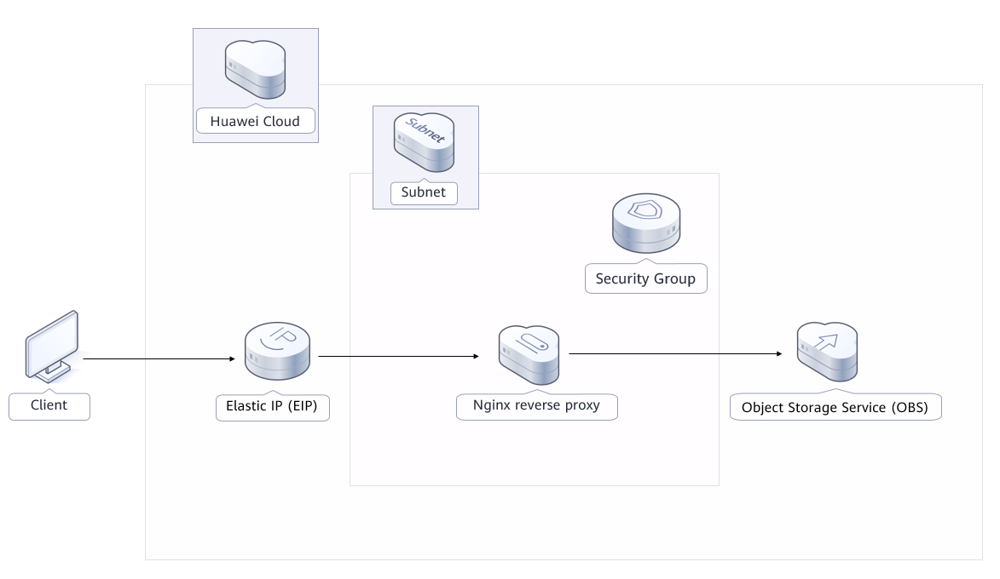
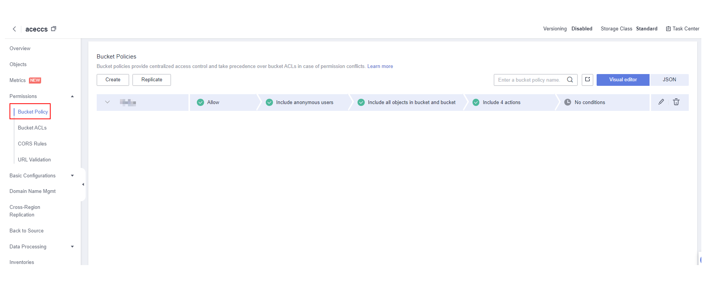
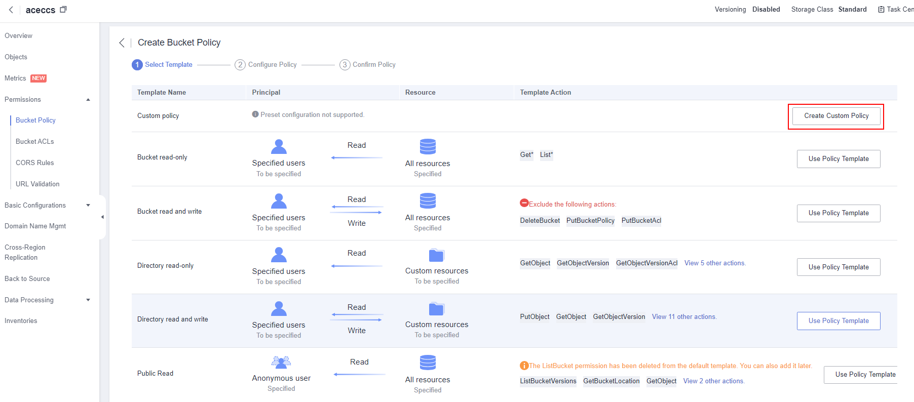
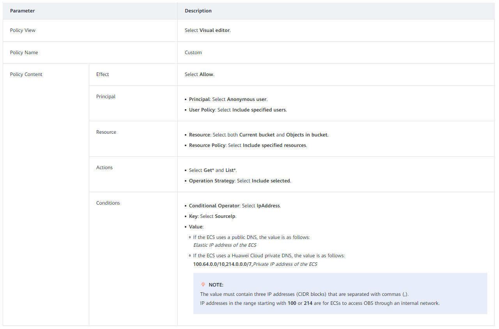
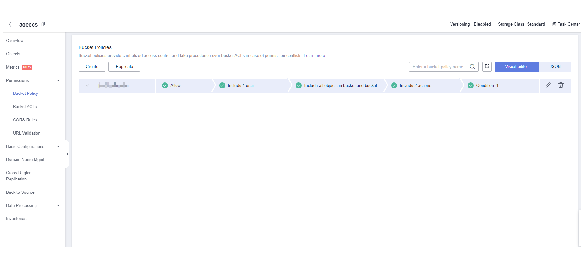
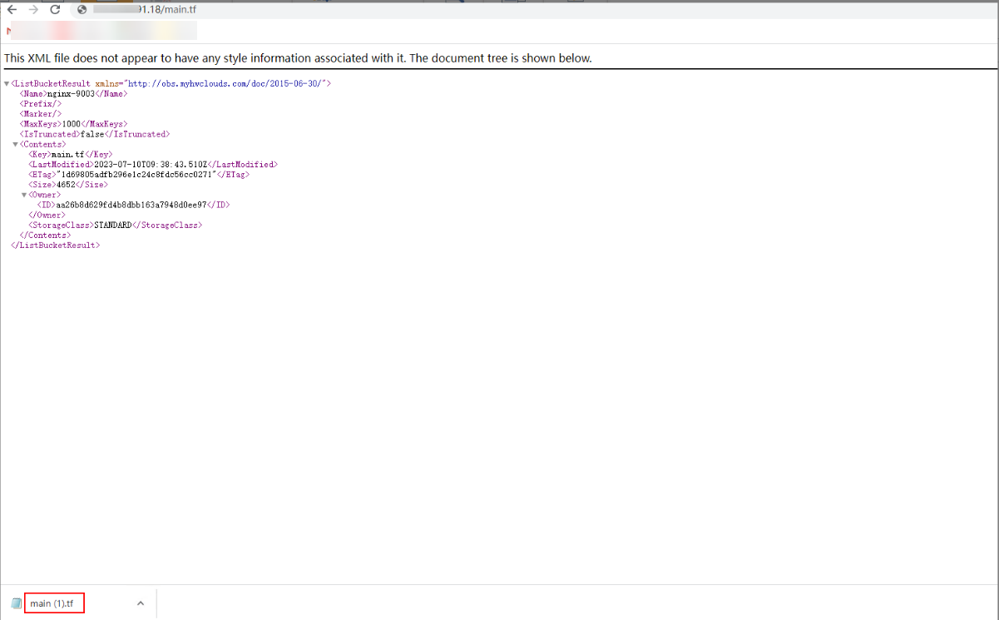

[TOC]

**Solution Overview**
===============
This solution deploys an Nginx reverse proxy on an Elastic Cloud Server (ECS), so that resources stored in an Object Storage Service (OBS) bucket can be accessed from a fixed IP address. With a reverse proxy configured, only the proxy server's IP address is exposed. The actual OBS domain name is hidden to enhance data security.

For details about this solution, visit https://www.huaweicloud.com/intl/en-us/solution/implementations/aobswnrp.html.

**Architecture**
---------------


**Architecture Description**
---------------
This solution will:
- Create an ECS for setting up an Nginx reverse proxy.
- Create an EIP and bind it to the newly created ECS. With the EIP bound, you can download the Nginx installation package on the ECS and provide access to external systems.
- Create a security group and configure access rules to secure the Nginx reverse proxy.

**File Structure**
---------------

``` lua
huaweicloud-solution-accessing-obs-through-nginx
├──accessing-obs-through-nginx.tf.json -- Resource orchestration template
├──userdata
	├──install_nginx.sh -- Script configuration file


```
**Getting Started**
---------------
**(Optional) Modifying Security Group Rules**

A security group is a collection of access control rules for cloud resources, such as cloud servers and containers, to control inbound and outbound traffic. Cloud resources associated with the same security group have the same security requirements and are mutually trusted within a VPC.
You can modify security group rules, for example, by adding, modifying, or deleting a TCP port, as follows:
- Adding a security group rule: [Add an inbound rule](https://support.huaweicloud.com/intl/en-us/usermanual-vpc/en-us_topic_0030969470.html) to enable a TCP port if needed.
- Modifying a security group rule: Inappropriate security group settings can be a serious security risk. You can [modify a security group rule](https://support.huaweicloud.com/intl/en-us/usermanual-vpc/vpc_SecurityGroup_0005.html) to ensure network security of your ECSs.
- Deleting a security group rule: If the source or destination IP address of an inbound or outbound security group rule changes, or a port needs to be disabled, [delete the security group rule](https://support.huaweicloud.com/intl/en-us/usermanual-vpc/vpc_SecurityGroup_0006.html).

**(Optional) Configuring an OBS Bucket Policy**

Notes:

If your bucket is public read or you want others to [add a signature in the URL](https://support.huaweicloud.com/intl/en-us/api-obs/obs_04_0011.html) when accessing objects in your private bucket, skip the following steps.

If you do not want URLs containing a signature to access resources in your private bucket, configure the following bucket policy that allows only the IP address of the Nginx proxy server to access your bucket.

1.Log in to [OBS Console](https://console-intl.huaweicloud.com/obs/?agencyId=n9UXiaaVYrpkdNTH45Trny8yAOvH6FnI&region=ap-southeast-3&locale=en-us#/obs/manager/buckets). In the bucket list, click the target bucket and choose **Permissions** > **Bucket Policy** from the navigation pane.

Figure 1 Going to the bucket policy page



2.Click **Create**. In the first row of the template list, click **Create Custom Policy** on the right.

Figure 2 Creating a custom policy



3.Configure the parameters listed in the following figure and click **Next** and then **Create** to complete the policy creation.

Figure 3 Bucket policy parameters



Figure 4 Bucket policy created



**Verifying the Reverse Proxy Settings**

1.In Google Chrome, access OBS resources with an address containing the ECS EIP and object name, for example, **http://*ECS EIP*/*Object name***.

Figure 5 Using a fixed IP address to access OBS resources




